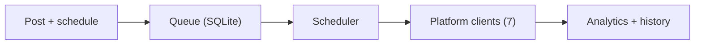

# Social Media Scheduler Pro

**Cross-platform desktop app to schedule and auto-post to X, Telegram, Reddit, Discord, Instagram, LinkedIn and TikTok.**

   



## Problem it solves

Posting to seven platforms by hand, at the right time, eats hours every week. This desktop app queues posts, threads and recurring content and publishes them on schedule.

Cross-platform desktop app for scheduling and managing posts across 7 social media platforms.

Built with **Flet** (Python) — works on macOS, Windows, and Linux.

## Features

- ** Schedule Posts** — Schedule posts to any of 7 platforms with date/time pickers
- ** Post Queue** — View pending, currently posting, and history sections
- ** Analytics** — Track total posts, success rates, and per-platform breakdowns
- ** Settings** — Manage platform accounts, configure the scheduler, export data
- ** Thread Support** — Multi-post threads for platforms that support them
- ** Recurring Posts** — Cron-based scheduling for recurring content
- ** Dark Theme** — Professional dark UI with platform-specific colors

## Supported Platforms

| Platform | Emoji | Status |
|----------|-------|--------|
| Twitter / X |  | Yes Simulated |
| Telegram |  | Yes Simulated |
| Reddit |  | Yes Simulated |
| Discord |  | Yes Simulated |
| Instagram |  | Yes Simulated |
| LinkedIn |  | Yes Simulated |
| TikTok |  | Yes Simulated |

> All platforms are simulation-ready. Real API integration requires adding API keys in Settings.

## Quick Start

```bash
# Install dependencies
pip install -r requirements.txt

# Run the app
python3 src/main.py
```

## Project Structure

```
social_scheduler/
├── requirements.txt        # Python dependencies
├── README.md              # This file
├── .gitignore             # Git ignore rules
├── config.json            # App configuration
├── data/                  # SQLite database (auto-created)
└── src/
    ├── main.py            # Entry point
    ├── __init__.py
    ├── models.py          # Data models (Platform, PostStatus, ScheduledPost)
    ├── database.py        # SQLite database operations
    ├── scheduler_engine.py # APScheduler-based dispatch engine
    ├── utils.py           # Utility functions
    ├── platforms/
    │   ├── __init__.py
    │   ├── base.py        # BasePlatform abstract class
    │   ├── factory.py     # Platform handler registry
    │   ├── twitter.py
    │   ├── telegram.py
    │   ├── reddit.py
    │   ├── discord.py
    │   ├── instagram.py
    │   ├── linkedin.py
    │   └── tiktok.py
    └── ui/
        ├── __init__.py
        ├── app.py         # Main UI (4 tabs)
        └── components.py  # Reusable UI components
```

## Architecture

The app uses a background scheduler (APScheduler) that checks every 30 seconds for posts whose `scheduled_at` time has arrived. When a post is due, it dispatches to the appropriate platform handler, updates the database, and records engagement metrics.

- **Schedule Tab**: Form to create posts + upcoming posts list
- **Queue Tab**: Three sections — Pending, Posting, History
- **Analytics Tab**: Summary cards, recent activity feed, per-platform breakdown
- **Settings Tab**: Account management, scheduler config, data export

## Development

To add real API integration for a platform, implement the `post()` and `validate_credentials()` methods in the corresponding platform handler file under `src/platforms/`.

## License

MIT
